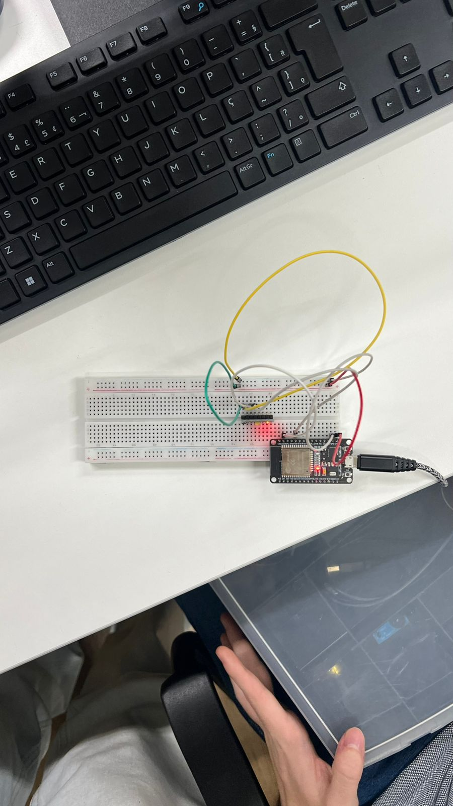
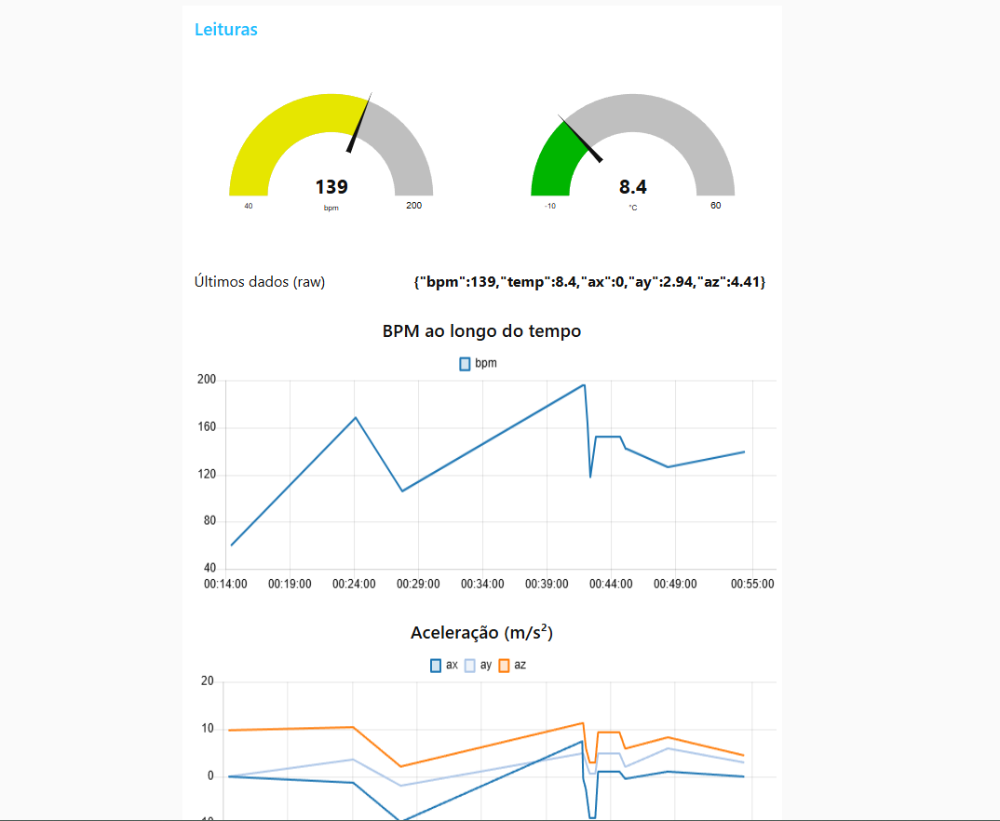

# Rep-Sprint3-PassaBolaXIoT
Repositório com um intuito demonstrativo e educativo de possível tecnologia a ser utilizada por jogadoras de futebol feminino.

# ❗Descrição do Problema❗
Queremos desenvolter uma solução simples para medir desempenho de atletas femimininas, fora isso nossa solução também incluí dados relativos ao batimento cardíaco e temperatura ambiente das jogadoras, tudo isso para além de tornar a modalidade do futebol feminino mais rica em dados, também ajude auxiliares, técnicos e aspirantes ao esporte a se interarem mais sobre o mesmo, com tais dados apresentando um papel fundamental no fornecimento de informação ao site desenvolvido paralelamente a essa solução.

# ⚽Nossa Solução⚽
Nossa solução abrange principalmente o conceito de Iot(Internet das Coisas), pois através do método de tranferência de dados MQTT podemos coletar dados pelo nosso ESP 32 e envialos ao um dashboard para melhor visualização dos mesmos.
Mas vamos dar um passo para traz. Nossa solução conta com dois sensores principais, o MPU6050 e um potenciometro simulando um sensor da batimentos cardíacos, o primeiro é um sensor focado na aceleração, rotação e temperatura; Para nossa solução não interessa a rotação das jogadoras, por isso apenas coletamos a aceleração e temperatura; O segundo sensor é resposável pela simulação de um sensor de batimentos. Com todos dados coletados, mandamos eles para o Node-Red via HiveMQ como broker, para assim acessarmos um dashboard para melhor visualização de dados.

## Montagem Wokwi

    

## Montagem Fisíca

    

## DashBoard no Node-Red

    

# Links
